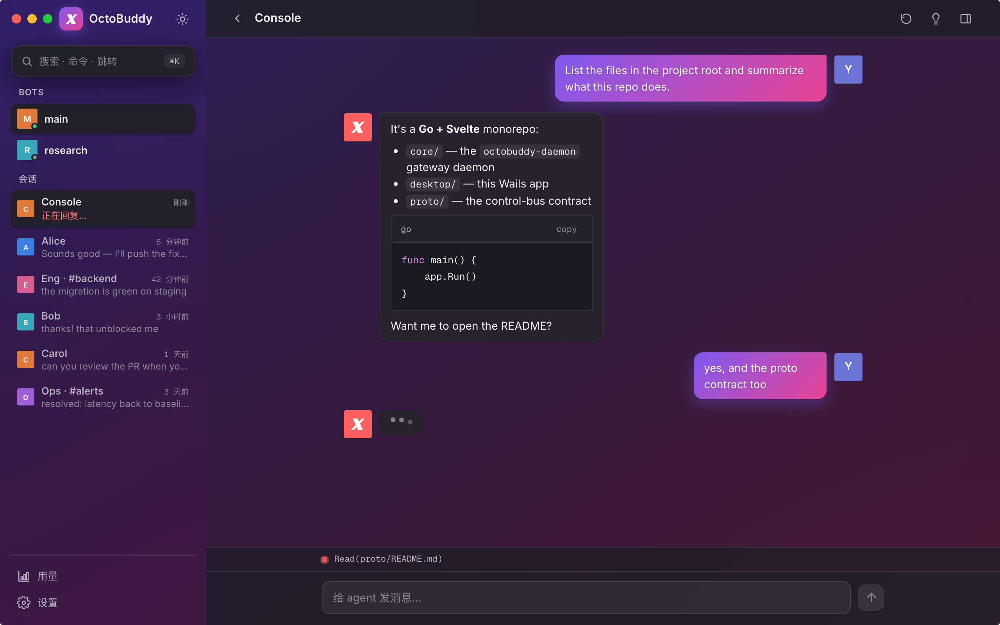
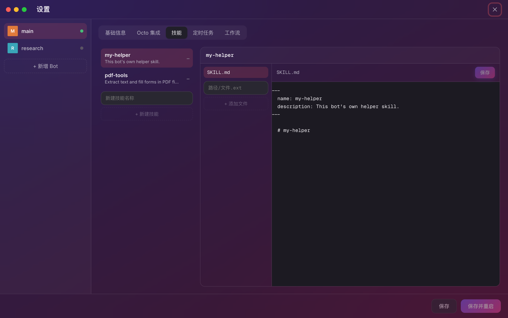

<div align="center">

# 🐙 OctoBuddy

**A cross-platform agent gateway.** OctoBuddy drives coding-agent CLIs — Claude
first — by spawning them and normalizing their output into one unified event
stream, with a clean, native-feeling desktop app on top. It replaces the
Node-only `claude-agent-sdk` with a single static Go binary that runs anywhere.

[](https://github.com/lml2468/octobuddy/actions/workflows/ci.yml)
[](LICENSE)




</div>

---

## What is OctoBuddy?

A coding agent like Claude ships as a CLI. OctoBuddy turns that CLI into a **service**:
it spawns the agent, feeds it inbound messages from a chat platform, streams the
agent's tokens/tool-calls back out as a normalized event stream, and persists the
conversation so the agent resumes where it left off.

Everything downstream of the `agent.Driver` abstraction depends only on a unified
`AgentEvent` vocabulary — never on Claude specifics. **Adding a second agent
(Codex, Gemini, …) means writing one new `Driver` and touching nothing else.**

The whole thing is a Go workspace of three pieces that version together against
one contract:

| | | |
|---|---|---|
| **`core/`** | the `octobuddy-daemon` daemon (the gateway) | Go, **single static binary, zero cgo**, cross-compiles to mac/linux/windows |
| **`desktop/`** | the desktop app | Go + **Wails v3** backend, **Svelte 5 + TS** frontend — a thin control-bus client |
| **`proto/`** | the control-bus contract | language-neutral NDJSON envelopes over a Unix socket, shared by both |

## Highlights

- **Agent-agnostic core** — the `agent.Driver` seam keeps the gateway, router,
  store, and control bus free of any per-agent details.
- **Multi-bot** — run many bots from one `~/.octobuddy/config.json`, each in a fully
  isolated stack (own store, gateway, sandbox, IM connector) under `~/.octobuddy/<id>/`.
- **Per-session sandboxing & resume** — every session gets a deterministic cwd +
  auto-memory dir; the gateway maps `sessionKey → resume_id` so turns continue
  across restarts (sessions persist).
- **Prompt-injection defense** — a non-overridable security prefix, a
  current-message anchor, and a sanitized rolling group-context window guard every
  group turn.
- **Per-bot skills + workflows** — each bot owns its own [Claude Code skills](https://docs.claude.com/en/docs/claude-code/skills)
  (SKILL.md bundles) and `Workflow` scripts under `~/.octobuddy/<id>/.claude/`; the
  CLI auto-loads them as user-scope assets every spawn. Author and edit them
  in-app — no shared marketplace, no install step.
- **Batteries** — per-bot scheduled tasks (cron), operator group instructions,
  on-behalf-of persona clones, opt-in tool-progress notices, and a bundled
  `octo-cli` companion with one-click upgrade.
- **Secrets stay out of config** — bot tokens live in the OS keychain
  (go-keyring, zero cgo) and are injected at runtime, never written to disk.
- **Polished desktop app** — a WeChat/iMessage-grade chat UI (token streaming,
  Markdown + code blocks, a bot rail, in-app Edit Bots / Manage Skills) — pure
  CSS/SVG, no native chrome.

## Screenshots

| Chat | Per-bot Skills |
|---|---|
|  |  |

## Architecture

```
┌─ desktop/ (Wails v3 + Svelte) ─┐        ┌─ core/ — octobuddy-daemon daemon ─────────────┐
│  spawns + supervises octobuddy-daemon    │  UDS   │  router → gateway turn pipeline      │
│  dials the control socket      │◀──────▶│  agent.Driver (Claude) → AgentEvents │
│  folds octobuddy:event → UI        │ NDJSON │  store (SQLite) · sandbox · safety    │
└────────────────────────────────┘        │  im/octo connector (WuKongIM + REST) │
            proto/ — one contract ─────────┘                                      
```

Inbound message → **router** (mention gate · bot-loop guard · sessionKey · rate
limit · per-session lock) → **store** (resume id) → **groupctx** (rolling group
context + answered/new segmentation) → **sandbox** (cwd + memory) →
**attachments materialized into cwd** → **buildSystemPrompt** (security prefix +
SOUL/AGENTS + roster + GROUP.md + persona) → **driver.Query** → stream
`AgentEvent`s (each resets a per-turn idle deadline) → assemble reply →
persist + send (sink emits `session.upserted` so the sidebar stays in sync).

See [`CLAUDE.md`](CLAUDE.md) for the full pipeline, invariants, and security model.
[`ARCHITECTURE.md`](ARCHITECTURE.md) is the navigation guide to the three
modules + three layers. [`PLATFORMS.md`](PLATFORMS.md) lists per-platform
dependencies and gotchas (read before shipping a change that might break
Linux/Windows).

## Quick start

**Prerequisites:** Go 1.26+. For the desktop app, the
[Wails v3 CLI](https://v3.wails.io): `go install github.com/wailsapp/wails/v3/cmd/wails3@latest`.

```bash
# 1) Build & test the Go core
cd core && go build ./... && go test ./...

# 2) Try the daemon directly — a REPL on stdin (type a message; /reset; Ctrl-D)
go run ./cmd/octobuddy-daemon

# 3) Run the desktop app in dev (builds core + `wails3 dev`)
zsh scripts/run-dev.sh --seed-config     # writes a starter ~/.octobuddy/config.json
zsh scripts/run-dev.sh --preview         # UI preview: mock data, no daemon

# 4) Cross-compile the daemon anywhere (zero cgo)
CGO_ENABLED=0 GOOS=linux GOARCH=amd64 go build -o /tmp/octobuddy-daemon ./cmd/octobuddy-daemon
```

### Package the desktop app (macOS)

```bash
# Builds OctoBuddy.app (+ .zip), embeds the signed octobuddy-daemon + octo-cli inside-out.
# Ad-hoc by default; pass an identity to Developer-sign, a profile (or an App
# Store Connect API key trio) to notarize.
OCTOBUDDY_SIGN_IDENTITY="Apple Development: …" zsh scripts/package-desktop.sh
```

Windows/Linux GUIs build on their own OS (`cd desktop && wails3 task package`);
the daemon already cross-compiles for all three.

### Releases

Cut from a single mac with `zsh scripts/release.sh vX.Y.Z` — the script
codesigns with your Developer ID, notarizes via App Store Connect API key,
and publishes a [GitHub Release](https://github.com/lml2468/octobuddy/releases)
with a universal macOS `.app.zip` plus headless `octobuddy-daemon` binaries
for darwin-arm64, darwin-amd64, linux-amd64, linux-arm64, and windows-amd64.
See [`docs/RELEASE.md`](docs/RELEASE.md) for one-time setup.

## Configuration

A single `~/.octobuddy/config.json` configures every bot — see the fully-commented
[`core/config.example.json`](core/config.example.json). Shared top-level
`apiUrl`/`agent`/`rateLimit`/`context` defaults, a `bots[]` array where each entry
overrides them, optional group-gating lists, and `onBehalfOf` persona clones. A
bot's persona/behavior lives in `SOUL.md` + `AGENTS.md` under `~/.octobuddy/<id>/`,
not in config. Tokens are **never** stored here — the desktop app keeps them in
the OS keychain. Skills + workflows live on the filesystem under each bot's
`~/.octobuddy/<id>/.claude/`, not in config. Everything is editable in-app (gear →
Edit Bots / Manage Skills / Workflows).

## Project layout

```
core/      Go gateway daemon (octobuddy-daemon): agent driver, router, gateway pipeline,
           SQLite store, sandbox, safety, config, cron, im/octo connector.
desktop/   Wails v3 app: Go bridge (supervisor · control client · configstore ·
           skills · workflows · octocli · secrets) + Svelte 5 frontend
           (lib/components, store, modals routed through a global confirm()).
proto/     The control-bus contract (NDJSON envelope schema). See proto/README.md.
scripts/   run-dev.sh · package-desktop.sh (cross-compile + embed + sign).
```

## Contributing

Issues and PRs welcome. Please read [`CONTRIBUTING.md`](CONTRIBUTING.md) and the
[`CODE_OF_CONDUCT.md`](CODE_OF_CONDUCT.md). CI runs `gofmt`, `go vet`, and the full
test suite (no API key needed — tests run against recorded fixtures).

## Security

OctoBuddy handles untrusted group-chat text and prompt-injection surfaces. Please
report vulnerabilities privately per [`SECURITY.md`](SECURITY.md).

## License

[MIT](LICENSE) © OctoBuddy contributors.
